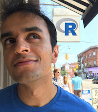

<h1>Logistics</h1>
For questions, concerns or bug reports, please contact <a href="http://web.stanford.edu/~monajemi/"> Hatef Monajemi</a> (@monajemi) or <a href="https://profiles.stanford.edu/david-donoho"> David Donoho</a>. This course meets Tuesdays 3:00-4:20 PM at  <a href="https://campus-map.stanford.edu/?srch=Thornt110"> Thornt110</a>. If you are a guest speaker for this course, please read <a href="#plan-your-visit"> travel section </a> to plan your visit. 



## [Follow Stat285 on ResearchGate (videos)](https://www.researchgate.net/project/Massive-Computational-Experiments-Painlessly)

## [Stats285 Hackathon](assets/hackathon/hack)

## Data Science News
* [SDSS18 Lecture: Painless Computing Models for Ambitious Data Science (Monajemi and coauthors)](assets/lectures/SDSS18_monajemi.pdf)
* [SDSS18 Lecture: A Paradigm for Research in Data Science (Papyan and coauthors)](assets/lectures/SDSS18_papyan.pdf)
* [Symposium for Data Science and Statistics by ASA, May 16-19, 2018](https://ww2.amstat.org/meetings/sdss/2018/)
* [Envisioning the Data Science Discipline (NAS)](https://www.nap.edu/read/24886/chapter/1)
* [The State of Data Science (Kaggle)](https://www.kaggle.com/surveys/2017)

##  Guest Lectures
---

<a class="talkdate" href="./piercy_lecture"> Tue, 10/02/2018</a>  
Mark Piercy  
Stanford (SRCC)

---

<a class="talkdate" href="./zaidi_lecture"> Tue, 10/23/2018</a>  
Ali Zaidi  
Microsoft

---

<a class="talkdate" href="./chambers_lecture"> Tue, 10/30/2018</a>  
John Chambers  
Stanford

---

<a class="talkdate" href="./kurtzer_lecture"> Tue, 11/6/2018</a>  
Gregory Kurtzer  
Sylabs

---

<a class="talkdate" href="./murri_lecture"> Tue, 11/13/2018</a>  
Riccardo Murri  
University of Zurich

---

<a class="talkdate" href="./mckinney_lecture"> Tue, 11/27/2018</a>  
Wes McKinney  
Ursa Labs

---

<!--

    

    
    

    

        <a class="talkdate" href="./vcs_lecture"> Monday, 10/16/2017</a>  
        Victoria Stodden  
        iSchool, UIUC
    

---

    

    
    

    

        <a class="talkdate" href="./percy_lecture"> Monday, 10/23/2017</a>  
        Percy Liang  
        Stanford
    

---

    

    
    

    

        <a class="talkdate" href="./travis_lecture"> Monday, 10/30/2017</a>  
        Travis Oliphant  
        Anaconda
    

---

<a class="talkdate" href="./murri_lecture"> Monday, 11/06/2017</a>  
Riccardo Murri  
University of Zurich

---

<a class="talkdate" href="./konwinski_lecture"> Monday, 11/13/2017</a>  
Andy Konwinski  
Databricks

---

-->

## [Assignments](./assignments)
## [Lecture slides](./lecture_slides)
## [Notes](notes)
## [Plan your visit](speaker_visit)
## [Visit previous iteration of Stats285 (2017)](2017)

